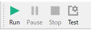

# AutoBatchTools

This application allows you to edit and execute a series of command line processes. It was created to easy the following processes.

- Re-edit scripts
- Searching for files with complex criteria
- Extend functions by C++ that are complicated to implement with existing scripts such as cmd and shell.
- Reuse of batch processes that have been created once


## What this software can do?

- Create and edit profiles to run executables, scripts, etc: [AutoBatchEditor](#AutoBatchEditor)

- Run the created profile: [AutoBatchRunner](#AutoBatchRunner)

- Schedule execution of created profiles: [AutoBatchScheduler](#AutoBatchScheduler)


## AutoBatchEditor


On the window, there are docks for Processing, Variables, Console, and File. The main window, Processing, and Variables are mainly used for editing profiles. The input file and console are used to test the edited profile for execution.

#### Variables (Variable / Value table)


Variables can be used in [Run](#Run) and [Plugin](#Plugin). There are three types of variables: Global, Local, and Input file. Variable names are converted in the order of global, local, and input file.

Types of variables available

- Global

  This is a common variable that is stored in the application. Once registered, it can be used in any profile you create.

- Local

  The variable is saved in the profile. It can only be used in the created profile.

- Input file

  The variable is used when calling an input file path. It is reserved and set automatically along with naming rules as follows.

```
Naming rules: numbers start from 0

$input_number_full$      // full path of input file
$input_number_dir$       // folder path of input file
$input_number_name$      // input file name
$input_number_basename$  // file name without extension
$input_number_extension$ // extension of input file
```

```
Example: If the input file is "C:\test\motion.mp4"

$input_0_full$           // "C:\test\motion.mp4"
$input_0_dir$            // "C:\test"
$input_0_name$           // "motion.mp4"
$input_0_basename$       // "motion"
$input_0_extension$      // "mp4"
```


#### Main Window

This is the place to edit the type and settings of the items added in [Process](#Process).


  1. ##### Information

     This is a function for displaying information. It is always created first when you create a profile. The profile name, author, version, and description can be described, and the settings for the profile to be created can be configured.

     

     

     | Profile           | Description                                                  |
     | ----------------- | ------------------------------------------------------------ |
     | Working directory | This is the default folder where profiles are executed and file searches are performed. The default value is the folder where the profile is saved (./). |

     | File Input                    | Description                                                  |
     | ----------------------------- | ------------------------------------------------------------ |
     | Allow file input              | Allows you to set whether to allow file input when executing a profile. If the check box is enabled, file input will be allowed. |
     | Enter search results as input | When this setting is enabled, a combo box for setting file search conditions will appear and can be selected. The list of files searched with the selected condition can be added to the input file variable. Regular file input will be added to the file search results. |

     | Loop Condition                   | Description                                                  |
     | -------------------------------- | ------------------------------------------------------------ |
     | Number of File Input in one loop | Specifies the number of files to be input in one loop. If there are more than the specified number of files, the profile will be loaded and executed repeatedly until it reaches the end of the input file list. |
     | Number of recursive loops        | The ProfileLoad function can make a self-call and perform a recursive loop when it registers itself. To avoid an infinite loop state, the maximum number of times the profile can be loaded can be specified. |
     | Process all input files          | If the check box is enabled, all input files will be processed. |
     | Maximum number of loops          | It is enabled when the 'Process all input files' checkbox is disabled. Specifies the maximum number of times this process will be executed. |

     

  2. ##### Executable

     You can edit the execution of executable files and scripts. You need to enter one command for each line of the table in the "Executable file / Arguments" header.

     

     

     ##### Options

     - Timeout

       You can set the timeout period when the file cannot be started or becomes busy for some reason. If unchecked, the timeout period will be infinite. When the timeout period expires, the next process, if any, will be executed.

       

     - Do not wait for execution to end

       If the check is enabled, the next process will be executed immediately without waiting for the completion of the executed process.

       

     - Valid only when schedule is executed

       If you want to run the program only during scheduled execution (AutoBatchScheduler), please enable the check box.

     

  3. ##### FileSearch

     File search is possible by adding search settings. The search settings are shared among applications. The file paths of the search results are concatenated with a separator and returned. File search results can be stored in a variable or output to a file.

     

     

     - Selecting file search conditions

       Select the file search settings. Click the plus button to display a dialog box for creating search settings. Click the minus button to delete the selected search settings. Clicking the pen icon will edit the selected file search settings.

       

     - Delimiter

       Sets the delimiter character when outputting search results. In addition to normal characters, line breaks and tabs are supported.

       ```
       Line Break: \n, \r, \r\n
       Tab: \t
       ```

       

     - Result

       - Store to variable
       
         Stores the result to the local or global variable selected in the combo box.
       
         
       
       - Output to file
       
         If the file with the same name exists in the output destination, you can choose to overwrite or append the file.

     ##### Options

     - Valid only when schedule is executed

       If you want to run the program only during scheduled execution (AutoBatchScheduler), please enable the check box.
       
       

  4. ##### Plugin

     By using a plugin, you can customize your application to include any functionality you want. Plugins can be added in the following ways :

     - Press the + button to add it.

     - Copying the file directly into the plugins folder in the program (. /plugins) in the program.

       

     If you add a plugin by pressing the + button, the absolute path of the plugin file will be registered, and if you copy the file into the plugin folder, the relative path of the file will be registered. For more information about plugins, please refer to abr-plugin-samples.

     

     

     

     

     ##### Options

     - Valid only when schedule is executed

       If you want to run the program only during scheduled execution (AutoBatchScheduler), please enable the check box.
       
       

  5. ##### ProfileLoad

     You can set up a different profile created by AutoBatchEditor. If you have saved the file you are editing, you can also set your own. When setting your own profile, set the maximum value if necessary as it may result in an infinite loop. The maximum count can set by Information -> Loop Conditions -> Recursive loop count.

     

     

     

6. ##### Options

  - Valid only when schedule is executed

    If you want to run the program only during scheduled execution (AutoBatchScheduler), please enable the check box.

    

#### Process


The table for editing the execution order of processes. You can add, delete, and so on from right-click or toolbar. By adding or editing the execution, search, and others, and saving it with a name, it can be processed by [AutoBatchRunner](#AutoBatchRunner) and [AutoBatchScheduler](#AutoBatchScheduler).


#### Input File


This is the input file table for testing the profile. Files can be added by dragging and dropping. When the Run button is pressed, the input file names are converted to input file variables in order from the top.


#### Console


The output will be displayed at run-time. If you need any input, you can click on the text box with ">" at the bottom and type in the required text and press Ctrl+Enter.


#### Enter the process test range here ...


You can check the operation by running a partial profile."Enter the process test range here..." text box with a numerical value or the following format to run the profile number corresponding to that value.

```
1-7     // Execute all of 1 through 7
8,10,11 // Execute 8, 10, and 11
1-4,6,7 // execute 1-4,6,7
```


#### Run / Pause / Stop / Test



You can execute the profile you have created. During execution, you can pause and stop for each execution number. Click the Test button to display Settings -> Test.


### Settings

#### General


- Temporary file location

  The location where backups of the profile being edited will be stored.

  

- Autosave interval

  The backup time interval of the profile, which can be set in 1 minute increments.

  

- Theme

  You can change the appearance of the application. The changes will be reflected after restarting the application.

  

- Window Font

  This is the font used in the application. This setting will be reflected after restarting the application.
  
  
  
- Language

  This is the font used in the application. This setting will be reflected after restarting the application.

  

  #### Process

  

  

- Hide the description of the "Type" column

   When enabled, it will hide the description in the second column of the "Process" table on the main screen.

  

- Background Color

  Sets the background color of the second column of the "Process" table on the main screen. You can enter the color directly or select it by clicking the ... button. The back button on the right side of the screen allows you to restore the setting.

- Text Color

  Sets the color of the text in the second column of the "Process" table on the main screen. You can enter it directly or select it with the ... button. To the right of this button is the possibility to restore the default settings.
  
  

#### Test


- Run as the scheduler process

  This option is for execution testing. Checking the checkbox will allow you to check the behavior of the scheduled execution.

  

#### Search

It is the management of search conditions shared among applications. You can add, edit, delete, etc. the [Search Settings](#Search&nbsp;Settings&nbsp;window).


#### Search settings window

When you select Add, the following search settings window will appear.


- Name

  It can set the name of the search condition.

  

- Keyword

  It allows you to set search terms. You can use wildcards (*) in the search terms.

  

- Folder

  A search folder can be set. It is not possible to set multiple separate folders.


#### Additional Conditions

- Regular Expression

  Apply a regular expression filter to the search results.

  

- Recursive (Folder)

  Searches all folders in a selected folder.

  

- From Search Time

  Finds files that were updated X (seconds/minutes/hours) ago from the time the search was performed.

  

- Created

  Apply the creation date filter to the files to be searched. (after/before)

  

- Modified

  Apply the modified date/time filter for the file to be searched. (after/before)

  

- File Size

  Apply filters based on file size. It may be slightly different in Windows.


#### Search Test

- Search

   This function allows you to attempt a search using the conditions you set. The search results will be output to a table.


#### Plugins

This is the management of loaded plugins. Auto Detected refers to the list stored in the plugins folder (. /plugins), and Manual refers to the list of files selected and added by the user. Only Manual items can be added or removed.


## AutoBatchRunner


This tool is used to execute files created by AutoBatchEditor.


### File / Folder Path

It allows you to add a file path to enter for the selected profile.


### Console

Displays the output that is being executed.


### Settings

It allows you to set the font, size, and language of the theme and application. There are three themes: Default, Light, and Dark, and you can choose between Japanese and English as the language. In order to expand the language, a translation file (*.qm) is required.


#### Profile

You can add and delete profiles. By adding a profile, you can select it from the combo box on the main screen.


#### Global Variables

It allows you to add, delete, and edit variables that can be used within this application.


#### Search

This is the management of search conditions that are shared among applications. The search settings you create will be used as common settings in AutoBatchScheduler.


#### Plugins

It is used to register plugins that are dependent on the profile created by AutoBatchEditor.


## AutoBatchScheduler


This tool is used to schedule execution of files created by AutoBatchEditor. When launched, it resides in the taskbar.

### Create a schedule

Right click on the [above](#AutoBatchScheduler) table and press Add from the action menu, the following window will appear. Select the schedule name, profile, set the schedule type, and press OK to add the schedule.


### Enabling and disabling schedules

You can change the status of the schedule by selecting the schedule you have set and clicking Enable or Disable from the right-click menu.


The schedule status can also be changed by clicking on the icon stored in the taskbar, and then clicking on the checkbox to the left of the setting name (to the left of test in the image below).


### Settings

#### General


- Store window in the task tray on startup

  If this checkbox is enabled, the window will not be displayed at startup.

  

- Theme

  Sets the style of the window.

  

- Window Font

  Set the font and size of the application.

  

- Language

  You can select the language. (Japanese, English)


#### Notification

It can set enables or disables application notifications and the time to display them.


- Minimized

  This is the notification display when an application is stored in the task tray.

  

Timer

- Started

  Displays a notification when the schedule is activated.

  

- Finished

  Displays a notification when the schedule is disabled or finished.

Task

- Started

  Displays a notification when a profile is executed.

  

- Finished

  Displays a notification at the end of profile execution.

  

- Canceled

  Displays a notification when the scheduled execution of a profile is canceled.


## Supported operating systems

| OS                    | Status              |
| --------------------- | -------------------- |
| Windows 10 x64 (21H1) | Confirmation of some operations |
| Ubuntu 21.04          | Checking the build and startup |


## License

This software is licensed under the MIT license. Check the LICENSE file in the main repo.

