# AutoBatchTools

[](https://github.com/karakirimu/AutoBatchTools/actions/workflows/unittest.yml)

コマンドライン処理の連続実行を編集し、実行できるアプリケーションです。以下の処理を容易にする目的で作成されました。

- スクリプトの再編集
- 複雑な条件のファイル検索
- 既存のcmdやshellなどのスクリプトで実装が煩雑な機能をC++プラグインを通して拡張
- 1度作成したバッチ処理の再利用


## このソフトウェアができること

- 実行ファイル、スクリプト等を実行するためのプロファイルの作成・編集: [AutoBatchEditor](#AutoBatchEditor)

- 作成したプロファイルの実行: [AutoBatchRunner](#AutoAutoBatchRunner)

- 作成したプロファイルのスケジュール実行: [AutoBatchScheduler](#AutoBatchScheduler)

  

## AutoBatchEditor

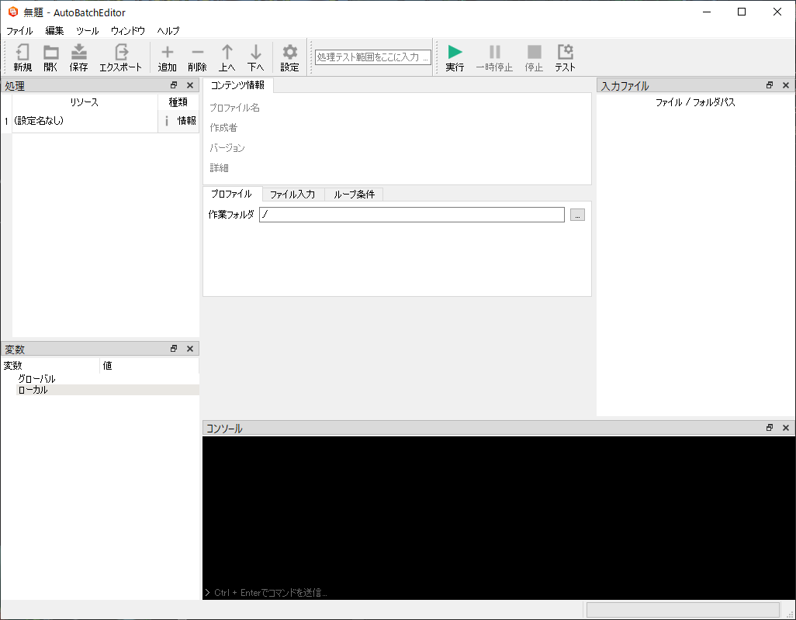

ウィンドウ上には、処理,変数,コンソール,ファイルのドックが存在します。メイン画面、処理、変数は主にプロファイルの編集に使用します。入力ファイル、コンソールは編集したプロファイルの実行用のテストで使用します。

#### 変数 (変数 / 値 テーブル)


[実行](#実行),[プラグイン](#プラグイン)にて変数を使用することが可能です。変数の種類はグローバル、ローカル、入力ファイルの3種類が存在します。変数名はグローバル→ローカル→入力ファイルの順に変換されます。

変数の種類

- グローバル

  アプリケーション内で保存される共通変数です。一度登録すると作成するすべてのプロファイルで使用することが可能です。

- ローカル

  プロファイル内に保存される変数です。作成したプロファイル内で使用することが可能です。

- 入力ファイル

  入力ファイル名を呼び出すときに使用される変数です。変数名は予約されており、以下の命名規則に従って自動的に変数が設定されます。

```
命名規則: 番号は0から開始

$input_番号_full$　     // 入力ファイルのフルパス
$input_番号_dir$        // 入力ファイルのフォルダパス
$input_番号_name$       // 入力ファイル名
$input_番号_basename$   // 拡張子なしのファイル名
$input_番号_extension$  // 入力ファイルの拡張子
```

```
例: 入力ファイルが"C:\test\motion.mp4"の場合

$input_0_full$　        // "C:\test\motion.mp4"
$input_0_dir$           // "C:\test"
$input_0_name$          // "motion.mp4"
$input_0_basename$      // "motion"
$input_0_extension$     // "mp4"
```


#### メイン画面

[処理](#処理)で追加した項目の種類や設定を編集する場所です。


  1. ##### 情報

     情報の表示機能です。プロファイルを作成する時に必ず最初に作成されます。プロファイル名、著者、バージョン、説明を記述することができ、作成するプロファイルに対するを設定を行うことができます。

     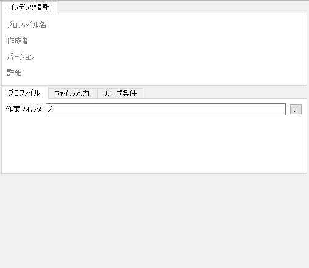

     

     | プロファイル | 詳細                                                         |
     | ------------ | ------------------------------------------------------------ |
     | 作業フォルダ | プロファイルの実行、ファイル検索を実行するデフォルトのフォルダです。初期値はプロファイルを保存したフォルダ(./)になります。 |

     | ファイル入力             | 詳細                                                         |
     | ------------------------ | ------------------------------------------------------------ |
     | ファイル入力の許可       | プロファイルの実行時、ファイルの入力を許可するか設定します。チェックが有効の場合、ファイルの入力が許可されます。 |
     | 検索結果を入力として利用 | この設定が有効になると、ファイル検索条件を設定するコンボボックスが出現し、選択できるようになります。選択した条件で検索されたファイルリストを入力ファイル変数に追加することができます。通常のファイル入力はファイル検索結果に追加入力されます。 |

     | ループ条件                   | 詳細                                                         |
     | ---------------------------- | ------------------------------------------------------------ |
     | ループ1回でのファイル入力数  | 1回のループで入力するファイルの数を指定します。指定数以上のファイルがある場合は、入力ファイルリストが無くなるまでプロファイルの読み込みと実行を繰り返します。 |
     | 再帰ループ数                 | プロファイル読込機能は自分自身を登録すると自己呼び出しを行い、再帰ループを行うことができます。無限ループ状態を避けるため、プロファイル読み込みの上限回数が指定可能です。 |
     | 入力ファイルをすべて処理する | チェックを有効にすると、入力されたファイルをすべて処理します。 |
     | ループの最大数               | '入力ファイルをすべて処理する'のチェックを無効にすると有効化されます。このプロセスを実行する最大回数を指定します。 |

     

  2. ##### 実行

     実行ファイルやスクリプトの実行の編集を行うことができます。"実行ファイル / 引数"ヘッダーのテーブルの1行に一つずつコマンドを入力する必要があります。

     

     

     ##### オプション

     - タイムアウト

       何らかの理由でファイルの起動ができなかったり、ビジー状態になった場合のタイムアウト時間を設定できます。チェックを外した場合、タイムアウト期間は無限になります。タイムアウト時間を過ぎた場合、次の処理が実行されます。

       

     - 実行終了を待機しない

       チェックを有効にした場合、実行した処理の終了を待機せずに、すぐに次の処理を実行します。

       

     - スケジュール実行時のみ有効

       スケジュール実行時(AutoBatchScheduler)のみに実行する場合、チェックを有効にしてください。

     

  3. ##### ファイル検索

     検索設定を追加することでファイル検索が可能です。検索設定はアプリケーション間で共有されます。検索結果のファイルパスは区切り文字を挟んで連結され、返却されます。ファイルの検索結果は変数に格納するか、ファイル出力が可能です。

     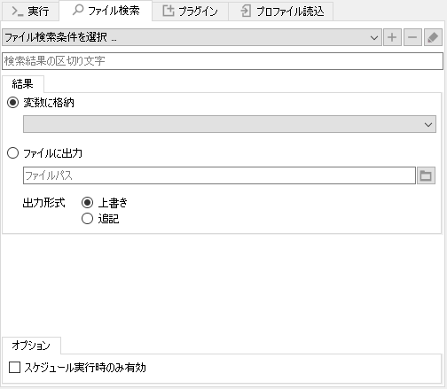

     

     - ファイル検索条件の選択

       ファイル検索の設定を選択します。＋ボタンをクリックすると検索設定を作成するダイアログが表示されます。([検索設定画面](#検索設定画面))-ボタンをクリックすると選択した検索設定を削除することができます。ペンのアイコンをクリックすると選択したファイル検索設定の編集を行うことができます。

       

     - 区切り文字

       検索結果を出力するときの区切り文字を設定します。通常の文字の他に、改行、タブに対応しています。

       ```
       改行 : \n ,\r, \r\n
       タブ : \t
       ```

       

     - 結果

       - 変数に格納
       
         コンボボックスで選択されたローカル、グローバル変数へ結果を格納します。
       
         
       
       - ファイルに出力
       
         出力先に同名のファイルが存在する場合は、上書きか追記を選択可能です。
       
       

     ##### オプション

     - スケジュール実行時のみ実行

       スケジュール実行時のみに実行する場合、チェックを有効にしてください。

       

  4. ##### プラグイン

     プラグインを追加することで、任意の機能をアプリケーションに組み込むことが可能です。プラグインの追加方法は、

     - ＋ボタンを押して追加する
     - プログラム内のプラグインフォルダ(./plugins)内にファイルを直接コピーする

     の2種類です。+ボタンを押して追加した場合は、プラグインファイルの絶対パスが登録され、プラグインフォルダ内にコピーした場合は、ファイルの相対パスが登録されます。プラグインについて詳しくは、abr-plugin-samplesを参考にしてください。

     

     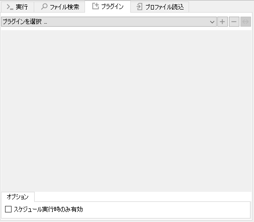

     

     ##### オプション

     - スケジュール実行時のみ実行

       スケジュール実行時のみに実行する場合、チェックを有効にしてください。

       

     

  5. ##### プロファイル読込

     AutoBatchEditorで作成した別プロファイルの設定が可能です。編集中のファイルを保存している場合、自分自身を設定することも可能です。自分のプロファイルを設定する場合は、無限ループを起こす可能性があるため、情報 → ループ条件 → 再帰回数を参照し、必要であれば上限回数を設定してください。

     

     

     

     ##### オプション
     
     - スケジュール実行時のみ実行
     
       スケジュール実行時のみに実行する場合、チェックを有効にしてください。

#### 処理


  処理の実行順序を編集するテーブルです。右クリックかツールバーから追加、削除等が可能です。実行、検索などの追加、編集し、名前を付けて保存することで、[AutoBatchRunner](#AutoBatchRunner), [AutoBatchScheduler](#AutoBatchScheduler)で処理が可能です。


#### 入力ファイル


プロファイルのテスト用のファイル入力テーブルです。ファイルをドラッグアンドドロップすることで追加することが可能です。実行ボタンを押すと、入力したファイル名を上から順番に入力ファイル変数に変換します。


#### コンソール

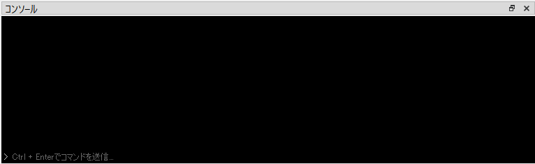

実行時に出力が表示されます。入力が必要な時は、下側の">”がある部分のテキストボックスをクリックし、必要な文字列をとCtrl+Enterを入力すると反映可能です。


#### 処理テスト範囲をここに入力 …


プロファイルの部分実行による動作確認が可能です。"処理テスト範囲をここに入力...”と書かれているテキストボックスへ数値、または以下のフォーマットを入力すると、その数値に対応するプロファイル番号を実行することができます。

```
1-7     // 1から7までを全て実行
8,10,11 // 8と10と11を実行
1-4,6,7 // 1から4,6,7を実行
```


#### プロファイルの実行・一時停止・停止・テスト


作成したプロファイルを実行することができます。実行中は、実行番号ごとに一時停止、停止が可能です。テストボタンをクリックすると、設定→テストを表示します。


### 設定

#### 一般

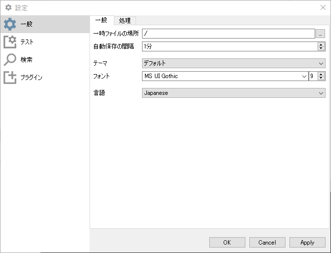

- 一時ファイルの場所

  編集中のプロファイルのバックアップが保存される場所です。

  

- 自動保存の間隔

  プロファイルのバックアップ時間間隔です。1分単位で設定可能です。

  

- テーマ

  アプリケーションの外観を変更できます。設定後再起動で反映されます。

  

- フォント

  アプリケーションで使用されるフォントです。設定後再起動で反映されます。
  
  
  
- 言語

  言語設定です。translationフォルダ内にあるファイルをロードします。EnglishとJapaneseが選択可能です。言語に対応するqmファイルをQt Linguistで作成することで言語追加が可能です。

  

  #### 処理

  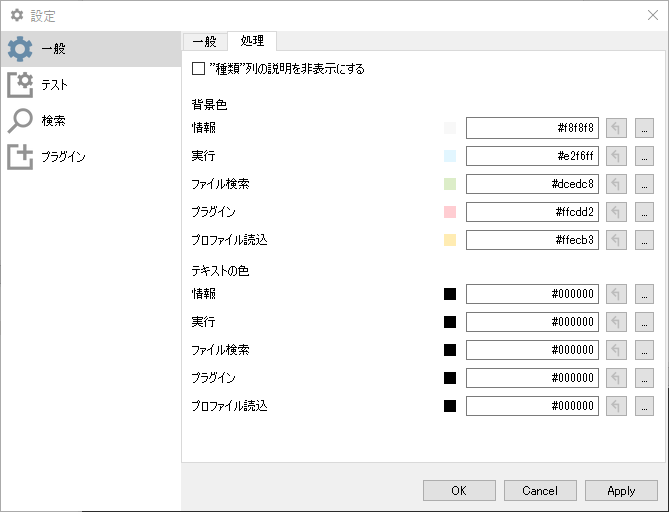

  

- "種類"列の説明を非表示にする

   有効にすると、メイン画面の"処理"テーブル2列目の説明を非表示にします。

  

- 背景色

  メイン画面の"処理"テーブル2列目の背景色を設定します。直接入力または…ボタンで色を選択可能です。右隣の戻るボタンで設定を戻すことが可能です。

- テキストの色

  メイン画面の"処理"テーブル2列目のテキストの色を設定します。直接入力または…ボタンで選択可能です。このボタンの右隣はデフォルトの設定に戻すことが可能です。
  
  

#### テスト

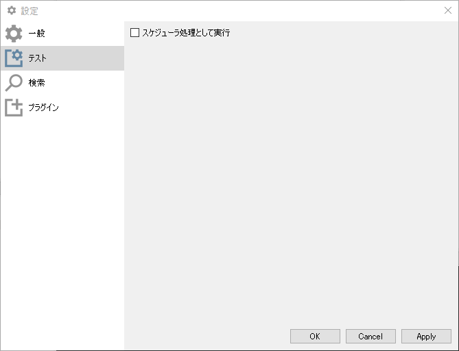

- スケジュール実行時として実行

  実行テストをする場合のオプションです。チェックボックスをオンにすると、スケジュール実行時の動作を確認することが可能です。

  

#### 検索

アプリケーション間で共有される検索条件の管理です。[検索設定](#検索設定ウィンドウ)の追加、編集、削除等の操作が可能です。作成した検索設定はAutoBatchSchedulerでも共通設定として使用されます。

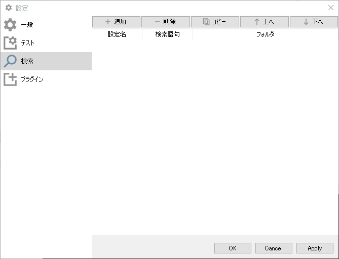

#### 検索設定ウィンドウ

追加を選択すると、以下の検索設定ウィンドウが出現します。

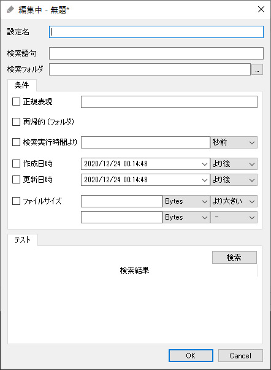

- 設定名

  検索条件の名前を設定できます。

  

- 検索語句

  検索語句を設定できます。語句にはワイルドカード(*)を使用することができます。

  

- 検索フォルダ

  検索フォルダを設定することができます。複数の別のフォルダを設定することはできません。


#### 条件

- 正規表現

  検索結果に正規表現フィルタを適用します。

  

- 再帰的

  フォルダ内のフォルダをすべて検索します。

  

- 検索実行時間よりX(秒/分/時間)前

  検索を実行した時間からX(秒/分/時間)前に更新されたファイルを検索します。

  

- 作成日時

  検索対象のファイルの作成日時フィルタを適用して検索します。(以降/以前)

  

- 更新日時

  検索対象のファイルの更新日時フィルタを適用して検索します。(以降/以前)

  

- ファイルサイズ

  ファイルサイズに応じてフィルターを適用します。Windowsではファイルサイズが若干異なる場合があります。


#### テスト

- 検索

  設定した条件で検索を試すことができます。検索結果はテーブルに出力されます。


#### プラグイン

ロードされたプラグインの管理です。自動検出はプラグインフォルダ(./plugins)に格納されたリスト、手動はユーザが選択して追加したファイルのリストを指します。手動の項目のみ追加、削除が可能です。

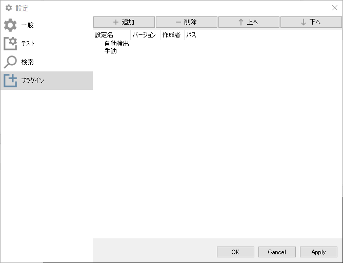


## AutoBatchRunner

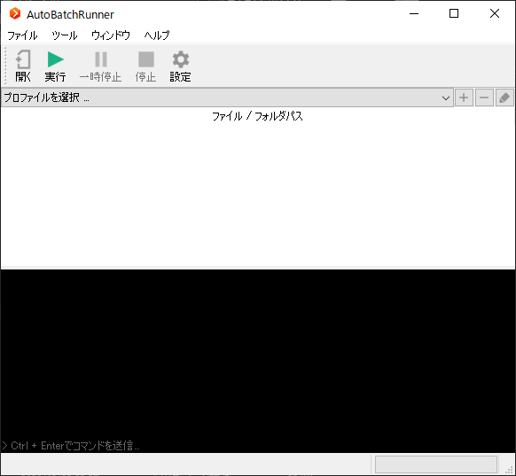

AutoBatchEditorで作成したファイルを実行するためのツールです。


### ファイル / フォルダパス

選択したプロファイルにロードするファイルパスを追加できます。


### コンソール

実行中の出力を表示します。


### 設定

テーマとアプリケーションのフォント、サイズ、言語を設定できます。テーマはデフォルト、Light、Darkの3種類あり、言語は日本語と英語が選択できます。言語の拡張するためには、翻訳ファイル(*.qm)が必要です。

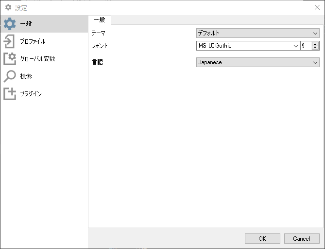


#### プロファイル

プロファイルの追加・削除を行うことができます。追加することにより、メイン画面のコンボボックスから選択が可能になります。

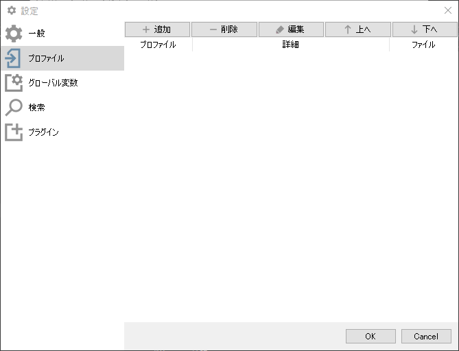


#### グローバル変数

このアプリケーション内で使用できる変数の追加・削除・編集を行うことができます。

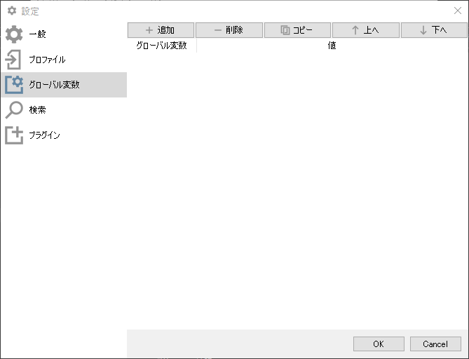


#### 検索

アプリケーション間で共有される検索条件の管理です。作成した検索設定はAutoBatchSchedulerでも共通設定として使用されます。

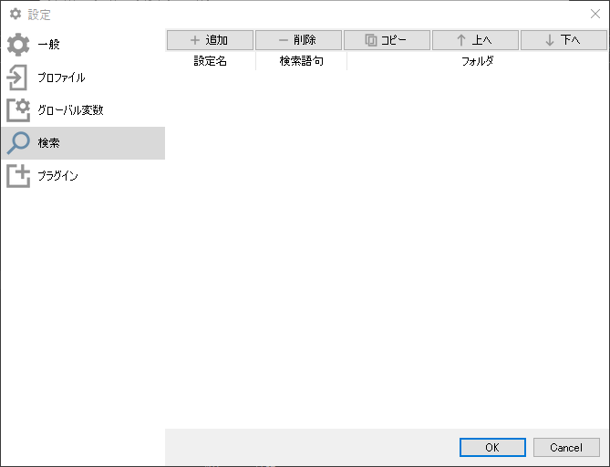


#### プラグイン

プラグインの追加、削除ができます。AutoBatchEditorで作成したプロファイルで依存しているプラグインの登録に使用されます。

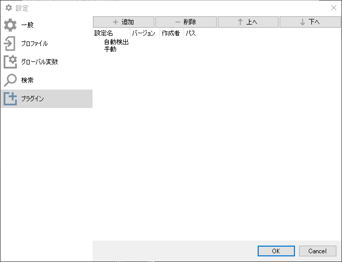


## AutoBatchScheduler

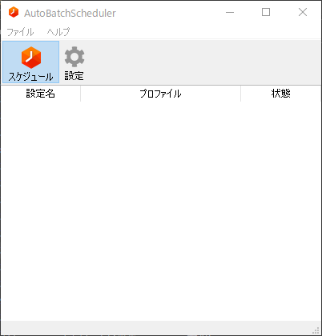

AutoBatchEditorで作成したファイルをスケジュール実行するためのツールです。起動すると、タスクバーに常駐します。

### スケジュールの作成

[上記](#AutoBatchScheduler)のテーブルを右クリックし、アクションメニューから追加を押すと、次のウィンドウが表示されます。スケジュール名、プロファイルの選択を行い、スケジュールのタイプを設定し、OKを押すとスケジュールが追加されます。

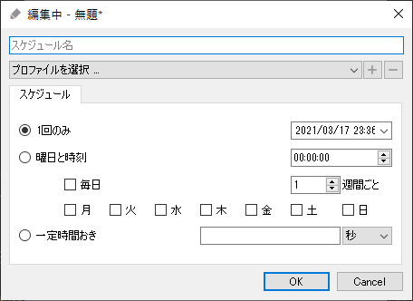


### スケジュールの有効化・無効化

設定したスケジュールを選択し、右クリックのメニューから、有効化または無効化をクリックすると、スケジュールの状態を変更することができます。

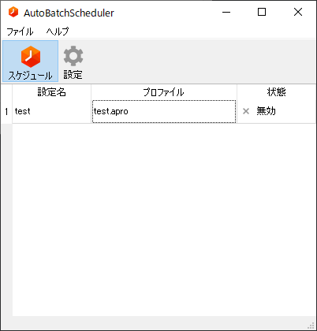

また、タスクバーに格納されたアイコンをクリックし、設定名左のチェックボックス(下の画像内ではtestの左)をクリックすることでも、スケジュール状態の変更が可能です。


### 設定

#### 一般


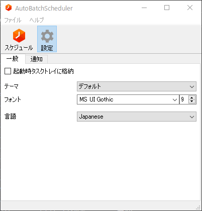

- 起動時にタスクトレイに格納

  チェックを有効にすると起動時にウィンドウを表示しません。

  

- テーマ

  ウィンドウのスタイルを設定します。

  

- フォント

  アプリケーションのフォントとサイズを設定します。

  

- 言語

  言語を選択できます。(日本語, 英語)


#### 通知

アプリケーション通知の有効・無効、表示する時間を設定します。

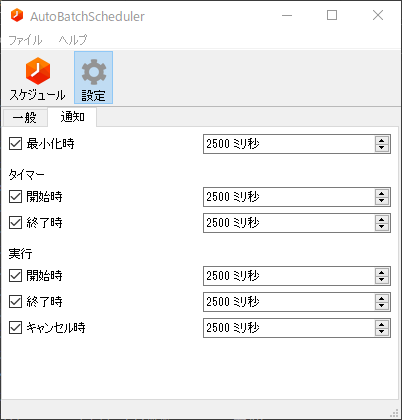


- 最小化時

  アプリケーションがタスクトレイに格納されたときの通知表示です。

  

タイマー

- 開始時

  スケジュール有効化時に通知を表示します。

  

- 終了時

  スケジュール無効化時、終了時に通知を表示します。

実行

- 開始時

  プロファイルの実行時に通知を表示します。

  

- 終了時

  プロファイルの実行終了時に通知を表示します。

  

- キャンセル時

  プロファイルのスケジュール実行キャンセル時に通知を表示します。


## 対応OS

| OS                    | 状況                 |
| --------------------- | -------------------- |
| Windows 10 x64 (21H1) | 一部動作の確認         |
| Ubuntu 21.04          | ビルド・起動の確認 |


## ライセンス

このソフトウェアはMITライセンスの下でライセンスされています。 mainリポジトリのLICENSEファイルを確認してください。

